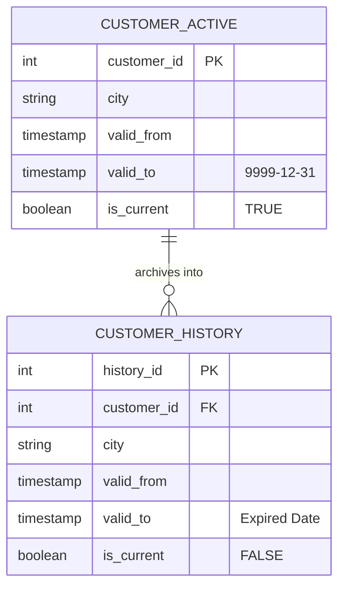
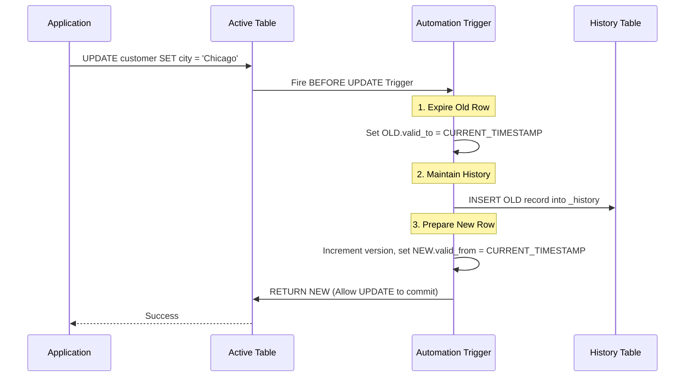

# Legacy Database vs Bi-Temporal Database
## Architectural Evolution of the Insurance Database System

This document provides an in-depth technical analysis of how the Insurance Database Management System evolved from a traditional relational architecture (Version 1) into a fully automated, enterprise-grade Bi-Temporal architecture (Version 2).

---

## 1. Version 1: The Legacy Architecture

The original system was designed as a strictly normalized relational database. It effectively mapped the complex domain of an insurance company into a traditional Entity-Relationship model.

### Database Design & Entity Relationships
The schema heavily utilized Foreign Keys to map relationships between the `COMPANY_BRANCH`, `AGENT`, `CUSTOMER`, and `POLICY`. Specialized insurance types (Health, Car, Home) were modeled using standard 1-to-0..1 relationships. 

### CRUD Workflow
The application interacted with the database using standard CRUD (Create, Read, Update, Delete) operations:
*   **Create:** `INSERT` statements added new customers and policies.
*   **Read:** Standard `SELECT` statements joined tables for reporting.
*   **Update:** Standard `UPDATE` statements modified existing rows in place.
*   **Delete:** Standard `DELETE` statements physically removed rows from the disk.

### Reporting
Reporting was strictly "current-state." Business intelligence dashboards (via Python visualizations) ran SQL queries to determine the *current* number of customers per city, or the *current* total premiums collected.

---

## 2. Limitations of Version 1: The Destructive Update

The fatal flaw of the legacy architecture—and of all traditional CRUD databases—is the **destructive update**.

### Practical Example: Address Change
Imagine a customer, John Doe, who has held an active auto policy since 2020. 
*   In 2020, John lived in **New York**.
*   In 2023, John moves and updates his address to **Chicago**.

In Version 1, the application executes:
```sql
UPDATE customer SET city = 'Chicago' WHERE customer_id = 101;
```

**The Result:** The fact that John lived in New York from 2020 to 2023 is **permanently destroyed**. 
If a claim is filed retroactively in 2024 for an accident that occurred in 2021 (when John lived in NY and paid NY premium rates), the database will falsely report that John lived in Chicago at the time of the accident. This data loss introduces massive legal and financial liabilities.

---

## 3. Motivation for Bi-Temporal Concepts

To solve the destructive update problem, the database required a paradigm shift toward a **Bi-Temporal** architecture. The motivations for this transition were heavily driven by enterprise requirements:

*   **Audit & Security:** Financial systems require an immutable audit trail. The system must record exactly *who* changed a record and *when* the change was committed to the disk.
*   **Compliance:** Regulations like SOX, HIPAA, and GDPR require companies to prove exactly what data they held at any specific point in history.
*   **Historical Reporting:** Actuaries and data scientists need to analyze historical trends (e.g., policy distributions over time) rather than just looking at a snapshot of today.
*   **Insurance Regulations:** Insurance is inherently time-based. Coverage, premiums, and risk factors change over time, and claims must be evaluated against the exact policy terms that were active *at the moment of the incident*.

---

## 4. The Bi-Temporal Architecture (Version 2)

Version 2 introduces two orthogonal dimensions of time to every single table in the database:

1.  **Valid Time (`valid_from`, `valid_to`):** Represents the time period during which a fact is true *in the real world*.
2.  **Transaction Time (`transaction_from`, `transaction_to`):** Represents the time period during which a fact is stored *in the database system*.

### Current vs. Historical Records
*   **Active Tables:** Contain only the current, active records (where `is_current = TRUE` and `valid_to = '9999-12-31'`).
*   **Historical Shadow Tables (`_history`):** A mirrored table for every entity that archives all closed, expired, or deleted versions of a record.



---

## 5. The Update Workflow in Version 2

Version 2 intercepts standard CRUD operations using dynamic PL/pgSQL triggers, converting them into an insert-only timeline. Application developers still write standard `UPDATE` commands, but the database handles the versioning autonomously.



---

## 6. Temporal Querying

Because history is perfectly preserved, the database natively supports "Time-Travel". By using `UNION ALL` Temporal Views (e.g., `v_customer_timeline`), analysts can query the entire timeline.

### Current Query (Standard)
Retrieves the customer's profile as it exists today.
```sql
SELECT * FROM insurance.customer WHERE customer_id = 101;
```

### Historical Query (Timeline Scan)
Retrieves every version of the customer's profile, ordered sequentially.
```sql
SELECT version_number, city, valid_from, valid_to 
FROM insurance.v_customer_timeline 
WHERE customer_id = 101 
ORDER BY version_number ASC;
```

### Time Travel Query (AS OF Date)
Retrieves the exact state of the customer exactly as they were on January 1st, 2021.
```sql
SELECT * FROM insurance.v_customer_timeline
WHERE customer_id = 101
  AND '2021-01-01 12:00:00' >= valid_from 
  AND '2021-01-01 12:00:00' < valid_to;
```
*(This complex query executes in milliseconds due to the underlying Temporal GiST indexing on the `tsrange` arrays).*

---

## 7. Architecture Comparison Table

| Metric | Version 1 (Legacy) | Version 2 (Bi-Temporal) |
| :--- | :--- | :--- |
| **Data Philosophy** | Data is a temporary state. | Data is an immutable timeline. |
| **UPDATE Operations** | Overwrites existing data. | Archives old data, inserts new version. |
| **DELETE Operations** | Physically destroys data. | Logically deletes (archives to history). |
| **Versioning** | None. | Native sequential numbering per record. |
| **Time Travel** | Impossible. | Natively supported via Temporal Views. |
| **Auditing** | Non-existent. | 100% autonomous trigger-based auditing. |
| **Storage Scale** | Flat footprint. | Expanding footprint (requires partitioned history). |
| **Performance (History)** | N/A. | Highly optimized via GiST `tsrange` indexing. |
| **Compliance Readiness**| Fails rigorous financial audits. | Cryptographically compliant (SOX, GDPR ready). |

---

## 8. Why Enterprise Systems Demand History

In a modern enterprise, **data is a liability if it cannot be proven**. 

When a multi-million dollar insurance claim goes to court, the insurance company cannot rely on a database that says "John lives in Chicago." The court requires proof of the exact terms, coverage limits, and residential address that were bound in the contract *at the specific time of the incident*. 

Furthermore, machine learning algorithms and actuaries rely entirely on historical trend analysis to price future risk. If a database continually destroys its own history through `UPDATE` statements, it strips the enterprise of its ability to learn from the past.

---

## 9. Key Takeaways

1.  **Destructive Updates are Dangerous:** Traditional CRUD apps destroy historical context, exposing enterprises to legal and financial risk.
2.  **Bi-Temporal is the Gold Standard:** By tracking both the real-world timeline (Valid Time) and the system timeline (Transaction Time), the database achieves perfect temporal accuracy.
3.  **Autonomous Operations Save Code:** By embedding the history management logic directly into PostgreSQL triggers, the application layer remains clean and unaware of the complex versioning happening underneath.
4.  **Time Travel is Powerful:** The ability to query the exact state of the world at any past millisecond unlocks limitless possibilities for auditing, compliance, and retroactive reporting.
