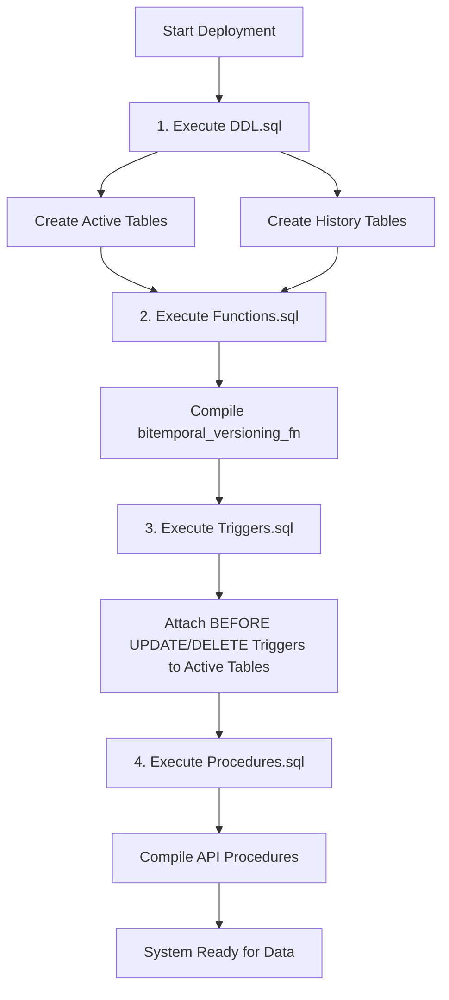
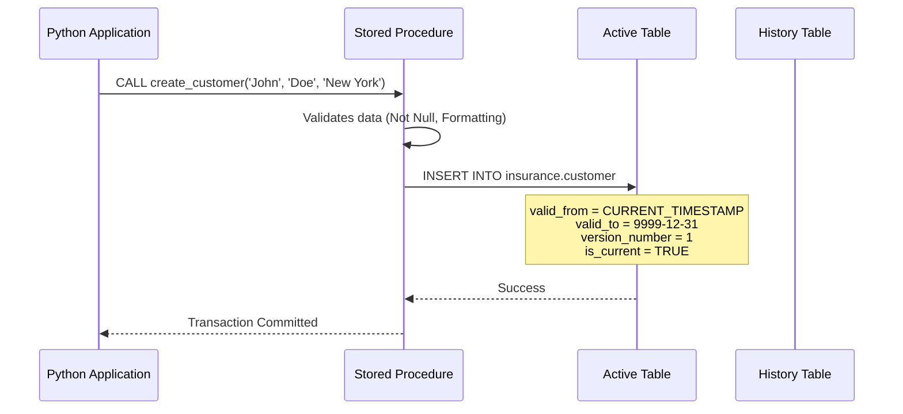
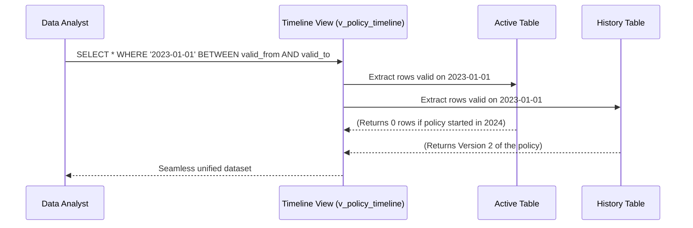

# Chapter 6: Execution Flow

This chapter details the exact sequence of events during the lifecycle of the Bi-Temporal database, from initial instantiation to complex time-travel querying.

---

## 6.1 Database Initialization Flow

When deploying the Phase 2 system from scratch, a strict execution order must be maintained because of the deep dependencies between Tables, Functions, and Triggers.



### The "Cold Start" Scenario
1. **Creation:** `CREATE DATABASE insurance_bitemporal;` is executed in pgAdmin.
2. **Schema:** The physical tables are built.
3. **Plumbing:** The dynamic PL/pgSQL function is loaded into memory, and the Triggers physically wire the tables to that function.
4. **API:** The 14 Stored Procedures (the only allowed method of data entry) are compiled.

---

## 6.2 Data Insertion Flow (The Baseline)

When the Jupyter Notebook executes the `initialize_database()` function, it simulates a legacy system dumping its current state into the new architecture.



**What exactly happens?**
When a customer is created, the system immediately recognizes this as `Version 1`. It sets the `valid_to` date to the year `9999` (PostgreSQL's representation of infinity), signifying that this is the active, current truth. The History table remains empty for this record.

---

## 6.3 Temporal Update Flow (The Close and Spawn)

This is the most complex and critical workflow in the entire project. It occurs when a customer's real-world status changes (e.g., they move to a new city).

```mermaid
flowchart TD
    subgraph App Layer
        A[Application calls update_customer_address]
    end
    
    subgraph Database API
        B[API executes UPDATE customer SET city = 'Boston']
    end
    
    subgraph Trigger Automation
        C{BEFORE UPDATE Trigger Fires}
        D[Take OLD row]
        E[Stamp valid_to = NOW()]
        F[Insert into _history table]
        G[Take NEW row]
        H[Increment version_number to 2]
        I[Stamp valid_from = NOW()]
    end
    
    subgraph Storage Layer
        J[(insurance.customer_history)]
        K[(insurance.customer)]
    end
    
    A --> B
    B --> C
    C --> D
    D --> E
    E --> F
    F --> J
    C --> G
    G --> H
    H --> I
    I --> K
```

**Step-by-Step Breakdown:**
1. **API Call:** The application calls the procedure `update_customer_address`.
2. **Standard SQL:** The procedure executes a standard `UPDATE` command.
3. **Interception:** The trigger halts the command before it writes to disk.
4. **Archiving:** The trigger takes the `OLD` data state, timestamps it, and securely locks it in the history table.
5. **Mutation:** The trigger mutates the `NEW` data state, incrementing the version to 2.
6. **Commit:** The new row replaces the old row in the active table.

---

## 6.4 Claim & Payment Workflows (Financial Integrity)

### The Payment Update Flow
When a user attempts to log a payment against a policy:
1. `record_payment` is called.
2. The procedure dynamically queries the `customer_policy` and `policy` active tables to find the exact premium amount required *today*.
3. If the payment mismatches, it executes `RAISE EXCEPTION`, rolling back the transaction. No triggers fire, no history is updated.

### The Claim Adjudication Flow
1. `register_claim` is called.
2. The procedure checks the `coverage` limit.
3. If valid, the claim is inserted. It starts as `Version 1` with a status of `PENDING`.
4. When `approve_claim` is later called, the trigger fires, archiving `Version 1` (PENDING) into history, and spawning `Version 2` (APPROVED) in the active table.

---

## 6.5 Time-Travel Query Flow

When a business analyst needs to view the database as it existed 3 years ago, they query the **Timeline Views**.



**What exactly happens?**
The Timeline view is a `UNION ALL` statement. It tells the PostgreSQL engine to scan both the active and history tables simultaneously. Because we utilize GiST indexes on the temporal ranges, the engine instantly filters out the millions of irrelevant records and returns the exact row that was valid on the requested date.

---

## Chapter 6 Summary
The execution flow of a Bi-Temporal database shifts the heavy lifting from the Application layer to the Database layer. Initializing the schema requires strict hierarchical execution (DDL -> Functions -> Triggers -> Procedures). Once deployed, the Triggers act as a flawless, autonomous middleman, intercepting basic `UPDATE` and `DELETE` commands to physically partition the data into current and historical states.

### Key Takeaways
- The **Close and Spawn** pattern is the heart of the temporal update flow.
- The **Timeline Views** utilize `UNION ALL` to hide the complexity of the two-table architecture from the end-user.

### Interview Tips
> **Tip:** If an interviewer asks you to draw the architecture on a whiteboard, focus entirely on the **Trigger Automation** flowchart shown in Section 6.3. It proves you understand the intersection of DML and procedural automation.

### Common Mistakes
- **Bypassing the API:** If a developer manually runs an `UPDATE` on the active table bypassing the stored procedure, the trigger *will* still fire and save history, but it might lack the business-context `change_reason` string that the procedure injects.

### Review Questions
1. Why must `Functions.sql` be executed before `Triggers.sql`?
2. Explain the "Close and Spawn" mechanism.
3. How does a Timeline View hide the complexity of the database from a data analyst?
