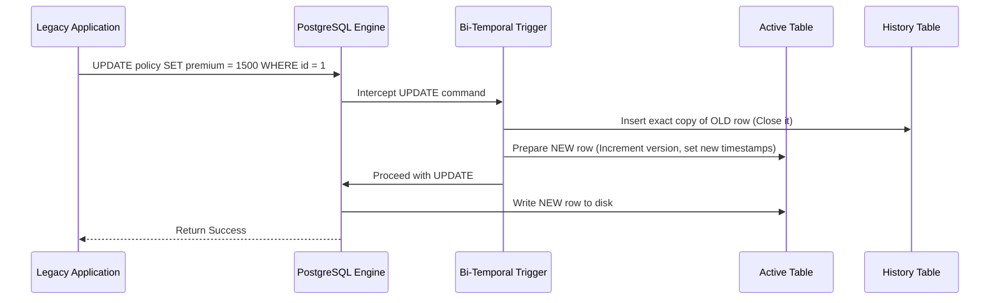
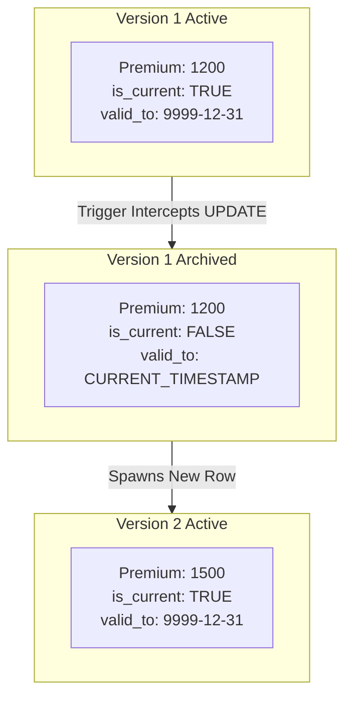
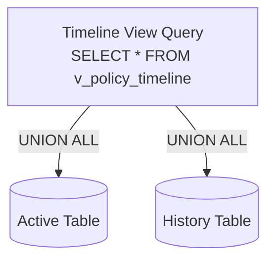

# Software Architecture Document: Evolution of a Bi-Temporal Insurance Database

## 1. Introduction
This document details the architectural evolution of the Insurance Database Management System. It tracks the migration from a traditional, static relational database (Phase 1) to an industrial-grade **Bi-Temporal Enterprise Database** (Phase 2). This architecture natively tracks the exact state of data across both real-world time and system clock time, guaranteeing 100% data immutability.

---

## 2. Initial Architecture (Phase 1: Legacy Database)

The initial architecture was a standard highly-normalized relational model. It utilized basic CRUD operations through direct SQL execution.

### Characteristics of Phase 1
- Standard Entity-Relationship design.
- Direct execution of `INSERT`, `UPDATE`, and `DELETE`.
- Reliance on `ON DELETE CASCADE` for referential integrity.
- Point-in-time querying (only the absolute present state was visible).

---

## 3. The Destructive Update Problem

The primary driver for the architectural overhaul was the identification of a fatal flaw in the legacy system: **Destructive Updates**.

When a standard RDBMS executes an `UPDATE` or `DELETE`, it physically overwrites the magnetic disk sectors holding the previous data. In a highly regulated environment like insurance, permanently destroying the historical premium of a policy or the previous address of a customer makes retroactive claim adjudication impossible and violates audit compliance.

---

## 4. Architectural Design Decisions

To resolve the destructive update flaw without severely impacting performance, the following design decisions were made:

1. **Autonomous Versioning:** The application layer cannot be trusted to manually insert historical records. Versioning must be pushed down to the database layer via automated PL/pgSQL Triggers.
2. **Physical Partitioning:** Active data and Historical data must be kept in physically separate tables to ensure current-state queries run at O(1) or O(log N) speeds.
3. **API Encapsulation:** Direct table access must be revoked. Applications must interface through strict Stored Procedures.
4. **Backward Compatibility:** Legacy applications must not crash when they execute a `DELETE`. The database must intercept it, perform a logical delete, and return success.

---

## 5. Schema Changes (Phase 2)

The schema was physically divided into two synchronized tiers for every entity.

**Key Alterations:**
- `ON DELETE CASCADE` was replaced with `ON DELETE RESTRICT` globally to prevent accidental data destruction.
- Associative bridge tables (`customer_policy`, `claim_policy`) were upgraded to track the timeline of relationships.

---

## 6. Temporal Design & Data Dictionary

To support bi-temporality, eight new metadata columns were injected into every table in the schema. This forms the temporal tracking engine.

| Column Name | Type | Description |
| :--- | :--- | :--- |
| `valid_from` | TIMESTAMP | **Valid Time:** When the fact became true in reality. |
| `valid_to` | TIMESTAMP | **Valid Time:** When the fact ceased to be true. |
| `transaction_from`| TIMESTAMP | **Transaction Time:** When the DB recorded the fact. |
| `transaction_to` | TIMESTAMP | **Transaction Time:** When the DB closed/archived the fact. |
| `version_number` | INT | Sequential tracker (1, 2, 3...) per entity. |
| `is_current` | BOOLEAN | TRUE if active, FALSE if archived. |
| `modified_by` | VARCHAR | User who executed the transaction. |
| `change_reason` | TEXT | Description of the business event causing the change. |

---

## 7. New Constraints & Data Integrity

Data integrity was shifted from the application layer down to the database engine via Stored Procedures.

- **Financial Validation:** The `register_claim` procedure dynamically looks up the active policy's `coverage`. If `amount_issued > coverage`, the transaction throws a `RAISE EXCEPTION`.
- **Payment Validation:** Triggers ensure that any `INSERT` into the `payment` table perfectly matches the active policy's `premium`.
- **Date Validations:** `renew_policy` ensures the new `end_date` is strictly greater than the current `end_date`.

---

## 8. Trigger Flow & Automation

The architecture relies on a master dynamic PL/pgSQL function: `insurance.bitemporal_versioning_fn()`. 
Every table has a `BEFORE UPDATE OR DELETE` trigger that fires this function.

---

## 9. The Temporal Update Flow

When an update occurs, the database performs a "Close and Spawn" operation.

1. **Close:** The OLD record's `valid_to` and `transaction_to` are set to `CURRENT_TIMESTAMP`. It is pushed to `_history`.
2. **Spawn:** The NEW record takes the update (Premium = 1500), increments `version_number` to 2, and sets its `valid_from` to `CURRENT_TIMESTAMP`.

---

## 10. Query Flow (Timeline Views)

To prevent applications from having to write complex `JOIN` logic against history tables, the architecture provides Timeline Views. 

These views utilize a `UNION ALL` statement to mathematically stitch the active and history tables back into a single, queryable timeline.

**Time-Travel Execution:** 
Analysts simply query the view:
`WHERE '2023-01-01' BETWEEN valid_from AND valid_to`
The database engine, accelerated by **Temporal GiST Indexes**, instantly returns the state of the entity exactly as it was on January 1st, 2023.

---

## 11. Migration Strategy

The migration from Phase 1 to Phase 2 was seamless for legacy applications due to the architecture's inherent backward compatibility:
1. **Views acting as Tables:** The legacy schema tables were renamed, and views were created with the original table names pointing to the active tier.
2. **Trigger Interception:** The triggers gracefully handle raw DML operations. If an application sends a destructive `DELETE`, the trigger converts it into a safe logical delete behind the scenes.
3. **Fallback Reasons:** If an application doesn't provide a `change_reason`, the trigger assigns a default (e.g., "Automated Application Update").

---

## 12. Lessons Learned

1. **Storage Amplification:** Bi-temporal databases require significantly more storage. Because data is never destroyed, a highly volatile table will grow exponentially. 
2. **Schema Evolution Complexity:** Adding a column requires altering the active table, the history table, and redefining the Timeline View. 
3. **Partitioning Necessity:** For long-term viability, history tables must utilize PostgreSQL Declarative Partitioning (e.g., partitioning by year) to maintain query performance as the history tier scales into hundreds of millions of rows.

---

## 13. Enterprise Benefits

The architectural evolution provided massive benefits to the insurance ecosystem:
- **Absolute Regulatory Compliance:** Every transaction is immutable. The database autonomously generates a flawless audit log that cannot be tampered with.
- **Retroactive Analysis:** Financial teams can rerun monthly revenue reports against historical states, ensuring pennies balance out exactly as they did three years ago.
- **Fraud Prevention:** Anomalous changes to bank accounts or claim payouts leave a permanent footprint, detailing exactly *who* made the change and *when* the system recorded it.
- **Zero-Downtime Migration:** Legacy applications did not require rewriting to support the new backend auditing capabilities.
